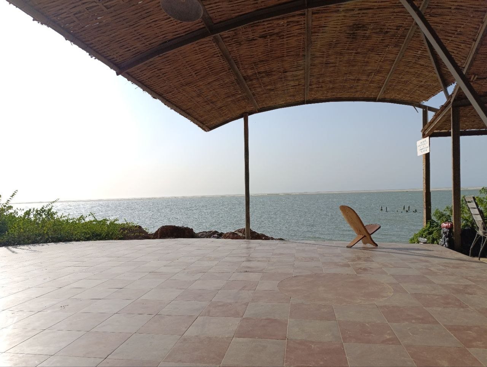
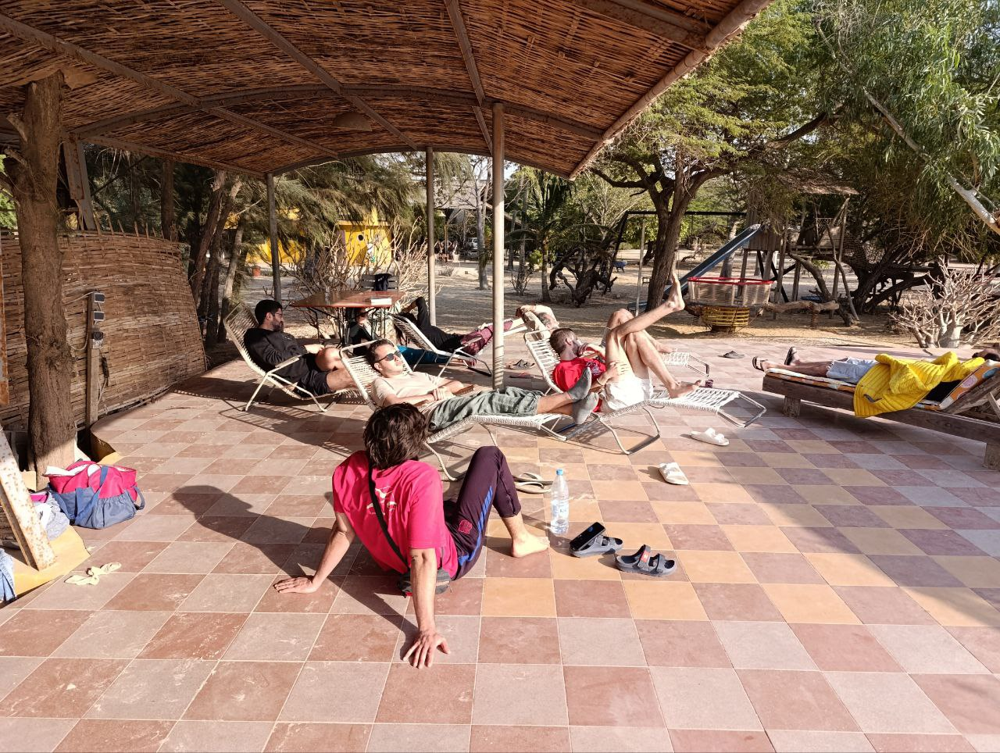

The day started off relaxed, with no rush. We woke up calmly and spent the morning working on pending tasks.

### Jaume and Joan: Synchronizing Zabbix with Telegram

Jaume and Joan focused on continuing the Zabbix setup, successfully synchronizing it with Telegram. They created two notification groups: one to receive all alerts, whether warnings or errors, which will allow us to constantly monitor the network and perform debugging tasks. The second group will only be activated when a router stops working for the entire day, making it easier for the local team to quickly identify network failures.

### Aitor and Sergio: Router Replacement and OpenWISP Issues

Aitor and Sergio worked on updating the Sunukeur network by replacing the master router. However, when they applied the OpenWISP configuration template, the router's graphical interface, LuCI, got misconfigured. They decided to leave the problem for the next day, as they needed more time to fix it properly without risking making the situation worse.

### Zebrabar

At lunchtime, we headed to Zebrabar, where we met up with some of Lorenzo and Pablo's friends, making a total of 24 people. The fish dish of the day was particularly popular.

After lunch, we spent some time at the place, once again enjoying the views and the peaceful atmosphere.

### Return to Sunukeur: Dinner and Football

On our return to Sunukeur, Lorenzo had organized dinner: grilled chicken with French fries and Fataya. After dinner, we set up the football match on a screen in the patio and enjoyed Barça's 7-1 victory.

