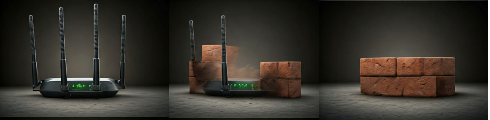
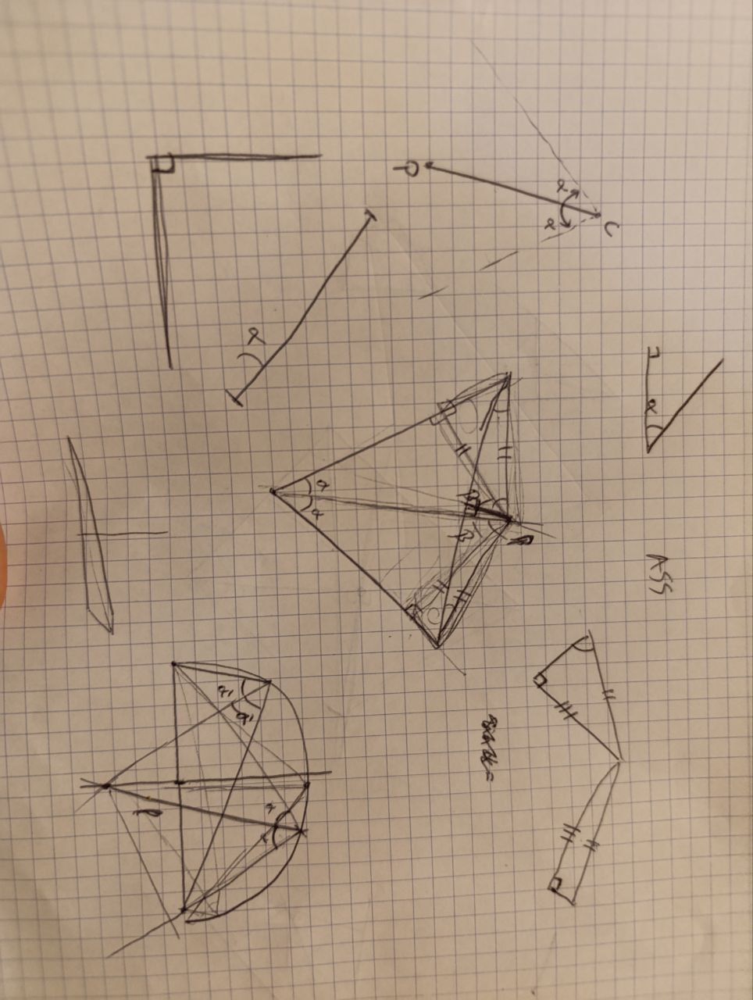

Hoy, lunes, comenzamos la semana con mucha energía y motivación despues de un finde de bastante relax.

## Resolviendo problemas con la red mesh en Aminata  
Por la mañana, Jaume y Joan han vuelto a Aminata equipados con la escalera y un objetivo claro: dejar totalmente operativa las installaciones. Al llegar, se encontraron con que el nodo principal no estaba bien configurado. Después de hacer un *reset* y configurarlo correctamente, ha sido relativamente sencillo desplegar los nodos secundarios, ya que estos ya estaban casi totalmente configurados correctamente.  

En el despacho de Tafa, mientras colocaban uno de los nodos secundarios, han advertido algunos intrusos inesperados: varios nidos de avispas africanas, más alargadas de lo habitual. Después de armarse de valor, han consguido dejar el router bien colocado en el despacho.

## Problemas y aprendizajes con OpenWISP  
Por su parte, Aitor y Roger se han dedicado a trabajar con los *templates* de configuración de OpenWISP, enfrentándose a algunos casos específicos que han generado numerosos problemas. Como resultado, han tenido que molestar varias veces a Laura para acceder a su despacho y reconfigurar el router principal.

Aunque los problemas no se han resuelto  por completo, el equipo de OpenWISP ha aprovechado el día para aprender mucho sobre el sistema de administración de red. Este conocimiento les permitirá avanzar de manera más sólida y eficiente en los próximos días.

## Sergio: el apoyo constante  
A todo esto, Sergio, a quien hoy le tocaba teletrabajar, ha sido un gran apoyo para todo el equipo. Ha estado asesorando y aportando claridad cada vez que los subequipos se encontraban con problemas que no sabían cómo desbloquear. Su experiencia y disposición para ayudar marcan siempre la diferencia!!

## Tarde de deporte y trabajo técnico  
Por la tarde, Joan y Sergio salieron a correr, y más tarde se han reunido con Aitor en el Teranga para disfrutar juntos de otra bonita puesta de sol.  

Mientras tanto, Jaume y Roger se dedicaron al tedioso proceso de *debrick*. Únicamente han conseguido deshacer el *brick* de uno de los cinco routers "corrompidos".

### ¿Qué es un debrick?  
El firmware original de los routers no permite realizar muchas de las funciones que nuestra red comunitaria requiere. Por ello, los “pirateamos” y les instalamos un firmware alternativo que desbloquea muchas más características. Sin embargo, si el firmware instalado no es totalmente compatible con el hardware, el router se corrompe y deja de funcionar (brick). En ese caso, se deben seguir una serie de pasos tediosos para restaurarlo. Si se consigue restaurar, se ha conseguido hacer un "debrick" con éxito.

## Un desafío matemático para cerrar la jornada  
Para terminar el día, después de cenar, Jaume ha planteado un problema matemático a Aitor y Joan que los ha tenido concentrados durante un buen rato. Nos encantan estos juegos de ingenio, que siempre logran poner nuestras mentes a prueba.  

