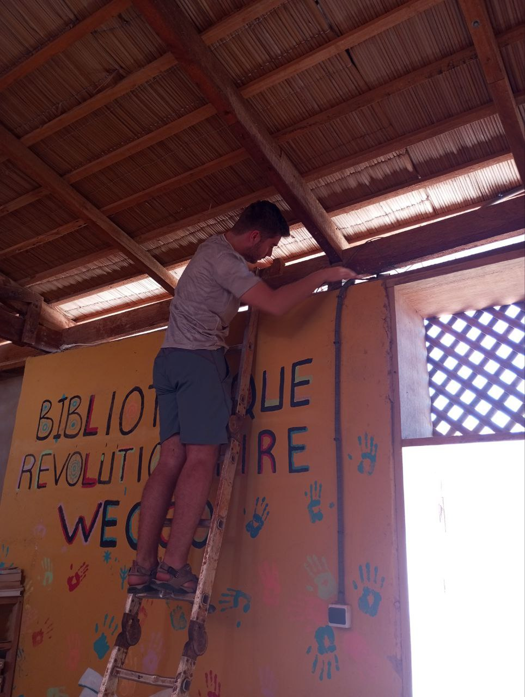
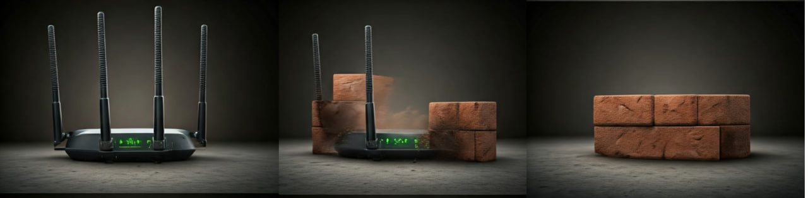

Today, Monday, we started the week with great energy and motivation after a very relaxing weekend.

## Solving Problems with the Mesh Network in Aminata  
In the morning, Jaume and Joan returned to Aminata equipped with a ladder and a clear goal: to make the installations fully operational. Upon arrival, they found that the main node was not properly configured. After resetting it and configuring it correctly, deploying the secondary nodes was relatively straightforward, as these were already almost entirely set up correctly.  
  

In Tafa’s office, while placing one of the secondary nodes, they encountered some unexpected intruders: several nests of African wasps, longer than usual. After mustering up the courage, they managed to install the router properly in the office.

## Challenges and Lessons with OpenWISP  
Meanwhile, Aitor and Roger focused on working with OpenWISP configuration templates, tackling specific cases that caused numerous issues. As a result, they had to bother Laura several times to access her office and reconfigure the main router.

Although the problems weren't fully resolved, the OpenWISP team took advantage of the day to gain substantial knowledge about the network management system. This understanding will allow them to move forward more confidently and efficiently in the days ahead.

## Sergio: The Constant Support  
Amidst it all, Sergio, who was working remotely today, was a great support for the entire team. He provided advice and clarity whenever the sub-teams encountered problems they couldn’t solve. His expertise and willingness to help always make a difference!  

## An Afternoon of Sports and Technical Work  
In the afternoon, Joan and Sergio went for a run and later joined Aitor at the Teranga to enjoy another beautiful sunset together.  
  

Meanwhile, Jaume and Roger worked on the tedious process of debricking. They managed to recover only one of the five “bricked” routers.  

### What is a Debrick?  
The original firmware of the routers doesn’t allow many of the functions required by our community network. Therefore, we “hack” them and install alternative firmware that unlocks many additional features. However, if the installed firmware is not fully compatible with the hardware, the router becomes corrupted and stops working (brick). In such cases, a series of tedious steps is needed to restore it. If we manage to restore the router, we have successfully achieved a "debrick"  
  

## A Math Challenge to End the Day  
To wrap up the day, after dinner, Jaume presented a math problem to Aitor and Joan, keeping them engrossed for quite a while. We love these brainteasers that always manage to challenge us.  
  

---
