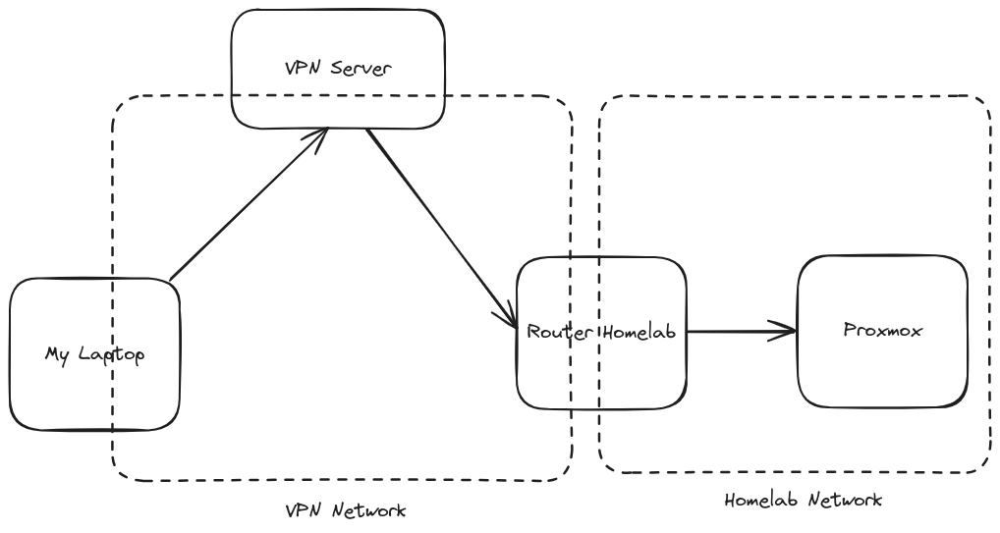

## Introduction


This guide explores two fundamental strategies for accessing your homelab services from outside your local network. Whether you're setting up a new homelab or optimizing an existing one, understanding when to use each approach is crucial for both security and functionality.



This is likely the first in a series of articles covering homelab remote access. Some friends have been asking questions about this setup, which is a great excuse to document everything properly.


## Two Strategies for Remote Access

It's important to differentiate between two distinct strategies for accessing your homelab services from the internet:

### 1. Service Exposure (Cloudflare Tunnels)

Exposing a single service or application to the public internet. For example, I serve [https://hahatay.network](https://hahatay.network) directly from my homelab.

**Use Case:** Public-facing services that need to be accessible to anyone on the internet.

### 2. VPN Access (Netmaker/WireGuard)

More sensitive services like my Proxmox web interface are kept behind a VPN. This is much more secure and versatile.

**Use Case:** Private services that only specific people or devices should access.

## When to Use Each Strategy

### Use Cloudflare Tunnels When

- You want to expose a **single service** for multiple people or machines to access from the public internet. For example, making a website like [https://hahatay.network](https://hahatay.network) accessible to everyone, regardless of their location.
- The service is designed for public consumption.
- You need simple, managed SSL/TLS certificates.

### Use a VPN When

- You want to access **multiple services** in your network from outside.
- You need **secure, controlled access** limited to specific users.
- You're accessing sensitive infrastructure (Proxmox, routers, management interfaces).
- You want access to your whole network (access to VMs, LXC containers, devices, etc.).

## Requirements and Considerations

### For VPN Setup

A VPN server requires a **publicly accessible IP address**. There are several options to achieve this:

#### Deploy your own VPS

I use a VPS with a public IP address. Affordable options include **Racknerd**, which offers very competitive pricing (no servers in Spain, but I have used them for years at an unbeatable price), and **IONOS**, another budget-friendly option with servers in Spain.


Use Affiliate Link to Create a VPS on Racknerd


#### Request a public IP from your ISP

Some internet service providers can assign you a static public IP, but this may involve additional monthly costs.

#### VPN Provider Solutions

Services like ProtonVPN might be an option (requires further investigation).

I went for the VPS approach because I assume the "worst case" where my ISP uses CGNAT (Carrier-Grade NAT) and there is no way that I can access my home network directly. In fact, this is what we have in Senegal in [https://hahatay.network](https://hahatay.network). It's even impossible to talk with a technical person in the ISP.

### For Cloudflare Tunnels

- You need a **domain managed by Cloudflare**
- The easiest approach is to purchase directly from Cloudflare's domain registrar
- Cloudflare Zero Trust account (free tier available)


Get a Cloudflare Domain


## Exposing Services via Cloudflare Tunnels

Cloudflare Tunnels are ideal for exposing a single service, such as:

- Personal website or blog
- Web application

**Requirements:**

- Domain registered with Cloudflare
- Cloudflare Tunnel configured

**Benefits:**

- No need to open ports on your firewall
- Free SSL/TLS certificates
- DDoS protection
- AI Crawler Protection
- Simple setup and management

## Exposing Services via VPN

A VPN solution allows you to expose multiple network elements securely:

- Virtual Machines or LXC containers running on Proxmox
- Network infrastructure (routers, access points)
- IoT devices (smart plugs, sensors)
- Any element within your network

### Setting Up the VPN Server

For those with ISPs using CGNAT, you'll need a VPS:

1. **Choose a VPS Provider**
   - Racknerd and IONOS are economical options
   - Look for VPS with at least 1GB RAM and 1 CPU core
   - Ensure it has a public IPv4 address

2. **Deploy WireGuard VPN**
   - I recommend using Netmaker for easy WireGuard deployment
     - See guide: **Deploy a WireGuard VPN easily using Netmaker**

### Integration Options

You have two main approaches for integrating VPN with your homelab:

#### Option 1: Router-Level Integration

- **Physical Router**: Install OpenWrt on a physical router
- **Virtualized Router**: Run OpenWrt as a VM
  - See guide: **Integrating OpenWrt with Netmaker**

#### Option 2: Expose Entire Proxmox

- Direct integration with Proxmox hypervisor
  - See guide: **Exposing your entire Proxmox using a VPN**

## Architecture Overview

## Next Steps

This article provides a high-level overview of the two strategies. In upcoming articles, I'll dive deeper into:

1. **Setting up Cloudflare Tunnels** - Step-by-step guide for exposing public services
2. **Deploying a WireGuard VPN with Netmaker** - Complete VPN server setup
3. **Integrating OpenWrt with Netmaker** - Router-level VPN integration
4. **Exposing Proxmox via VPN** - Secure access to your entire virtualization environment
5. **Security Best Practices** - Hardening your remote access setup

## Conclusion

Choosing between Cloudflare Tunnels and VPN access depends on your specific use case:

- **Cloudflare Tunnels** - Quick, easy, perfect for single public services, forget about managing security and certificates.
- **VPN** - Comprehensive, secure, ideal for private infrastructure access, but you need to deal with DNS and certificates yourself.
