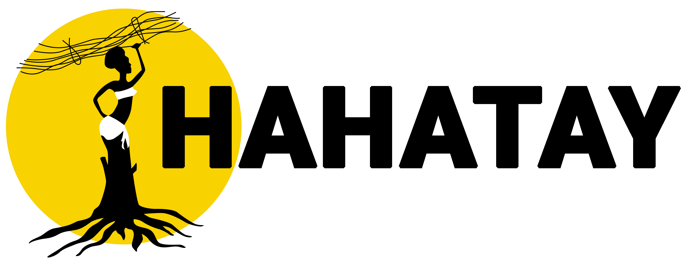
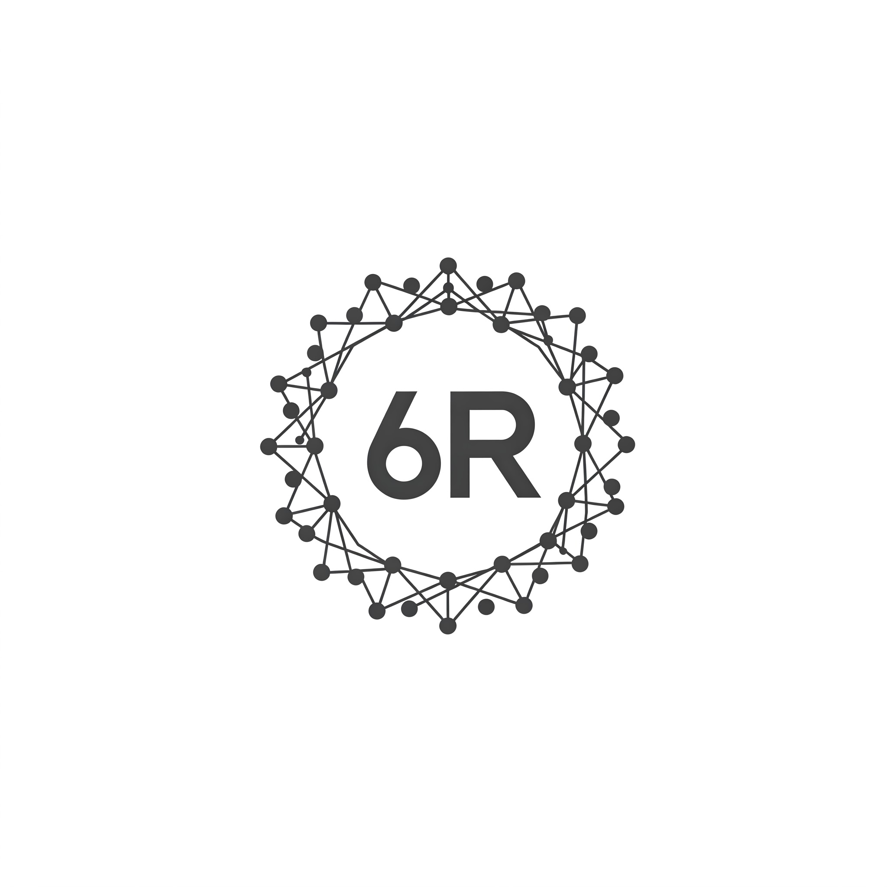
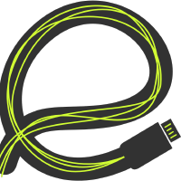

# My Projects and Contributions

Welcome to my projects page! Here, you'll find an overview of the various initiatives and contributions I've been involved in over the years. From side projects and open-source software to non-tech endeavors, this page showcases my passion for learning, creating, and making a positive impact in both the tech and non-tech worlds. Explore the sections below to learn more about the work I do and the causes I support.

## Side Projects

These are side projects I work and contribute on in my free time.

<table class="project-table">
    <thead>
        <tr>
            <th>Logo</th>
            <th>Title</th>
            <th>Description</th>
            <th>Contribution</th>
            <th>References</th>
        </tr>
    </thead>
    <tbody>
        <tr>
            <td></td>
            <td>
              Hahatay Network
              Active
            </td>
            <td>A volunteer-driven community network in rural Senegal</td>
            <td>Started in 2021, now leading technical efforts.</td>
            <td>
              <a target="_blank" href="https://hahatay.network">Site</a> 
              <a target="_blank" href="https://github.com/aucoop/hahatay-community-network">GitHub</a> 
            </td>
        </tr>
        <tr>
            <td></td>
            <td>
              6G-RUPA
              Active
            </td>
            <td>Advocating on improving networks of the future using recursive networks</td>
            <td>This is what my whole PhD is about</td>
            <td>
              <a target="_blank" href="https://6grupa.com">Site</a> 
            </td>
        </tr>
        <tr>
            <td></td>
            <td>
              AUCOOP
              Active
            </td>
            <td>Student's association at the UPC that works on cooperation projects related with IT</td>
            <td>Actively involved since 2017</td>
            <td>
              <a target="_blank" href="https://aucoop.upc.edu/">Site</a> 
            </td>
        </tr>
        <tr>
            <td></td>
            <td>
              eReuse
              Active
            </td>
            <td>Contributing to open source software made by eReuse, specifically a device management system for reusing and refurbishing, erasing hard-drives, and diagnosing components</td>
            <td>Contributions to eReuse software suite</td>
            <td>
              <a target="_blank" href="https://www.labdoo.org/en/">Site</a> 
            </td>
        </tr>
        <tr>
            <td></td>
            <td>
              Labdoo
              Active
            </td>
            <td>Labdoo is a social network of volunteers that provides refubrished laptops to schools in need</td>
            <td>Hub Manager at <a href="https://platform.labdoo.org/content/labdoo-hub-barcelona-i2cat-campus-nord" target="_blank">i2CAT</a> and <a href="https://platform.labdoo.org/hub?h=86019" target="_blank">AUCOOP</a> at the UPC, contributing to projects in <a href="https://platform.labdoo.org/edoovillage?e=223473"target="_blank">Senegal</a>, Namibia and <a href="https://platform.labdoo.org/edoovillage?e=223473"target="_blank">Pakistan</a></td>
            <td>
              <a target="_blank" href="https://www.labdoo.org/en/">Site</a> 
            </td>
        </tr>
    </tbody>
</table>

## Tech Pet Projects

These are small projects that I work now or have worked in the past. They are usually not very big, but they are a good way to learn something new and share it with the world.

<table class="project-table">
    <thead>
        <tr>
            <th>Title</th>
            <th>Status</th>
            <th>Description</th>
            <th>References</th>
        </tr>
    </thead>
    <tbody>
        <tr>
            <td>Github wiki to hugo</td>
            <td>Active</td>
            <td>A project that converts pages from a Github wiki into hugo articles</td>
            <td><a target="_blank" href="https://github.com/sergio-gimenez/python-scaffolding">GitHub</a></td>
        </tr>
        <tr>
            <td>Python Scaffolding</td>
            <td>Active</td>
            <td>A Python scaffolding project</td>
            <td><a target="_blank" href="https://github.com/sergio-gimenez/python-scaffolding">GitHub</a></td>
        </tr>
        <tr>
            <td>Anomaly 4G Detection</td>
            <td>Archived</td>
            <td>A project for detecting anomalies in 4G networks</td>
            <td><a target="_blank" href="https://github.com/sergio-gimenez/anomaly-4G-detection">GitHub</a></td>
        </tr>
        <tr>
            <td>Blockfunding</td>
            <td>Archived</td>
            <td>A blockchain-based crowdfunding platform</td>
            <td><a target="_blank" href="https://github.com/gerardcastell/blockfunding">GitHub</a></td>
        </tr>
    </tbody>
</table>

## Open Source Software

I am a strong believer in open source software, so I have allocated a few bucks every month to support some of the projects that I use almost everyday and would be hard to live without them.

<table class="project-table">
    <thead>
        <tr>
            <th>Title</th>
            <th>Description</th>
            <th>References</th>
        </tr>
    </thead>
    <tbody>
        <tr>
            <td>Graphene OS</td>
            <td>De-googled, privacy friendly Android OS</td>
            <td><a target="_blank" href="https://grapheneos.org/">Site</a></td>
        </tr>
        <tr>
            <td>Betterbird</td>
            <td>My day-to-day mail client, calendar aggregator and matrix client</td>
            <td><a target="_blank" href="https://www.betterbird.eu/">Site</a></td>
        </tr>
        <tr>
            <td>Logseq</td>
            <td>A privacy-first, open-source knowledge base</td>
            <td><a target="_blank" href="https://logseq.com/">Site</a></td>
        </tr>
        <tr>
            <td>Elementary OS</td>
            <td>My main Linux Distro since 2019</td>
            <td><a target="_blank" href="https://elementary.io/">Site</a></td>
        </tr>
        <tr>
            <td>Bitwarden</td>
            <td>My password manager of choice</td>
            <td><a target="_blank" href="https://elementary.io/">Site</a></td>
        </tr>
    </tbody>
    </table>

## Non-Tech Projects

Here is a list about non-tech projects I'm involved to. I believe that technology can be used to improve the world, but it is not the only way to do so. I am involved in several non-tech projects that aim to make a difference in the world. 

<table class="project-table">
    <thead>
        <tr>
            <th>Title</th>
            <th>Description</th>
        </tr>
    </thead>
    <tbody>
        <tr>
            <td>Campervan Conversion</td>
            <td>Converting my old Citroen Jumpy from 2006 into a functional campervan for traveling around Spain and Europe in Summer, and attending festivals.</td>
        </tr>
        <tr>
            <td>Winemaking</td>
            <td>Making my own wine from grapes grown by my family.</td>
        </tr>
    </tbody>
</table>

