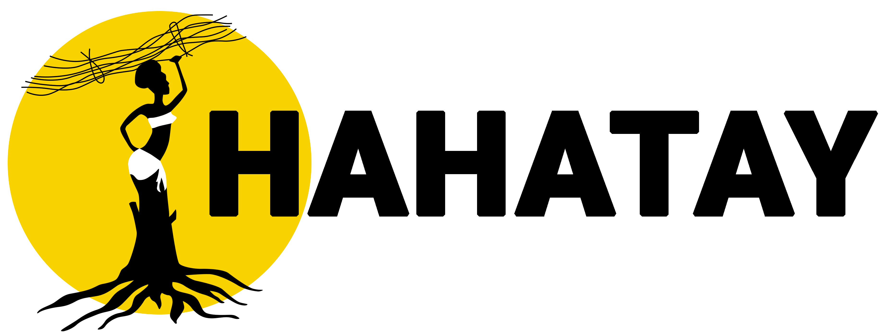
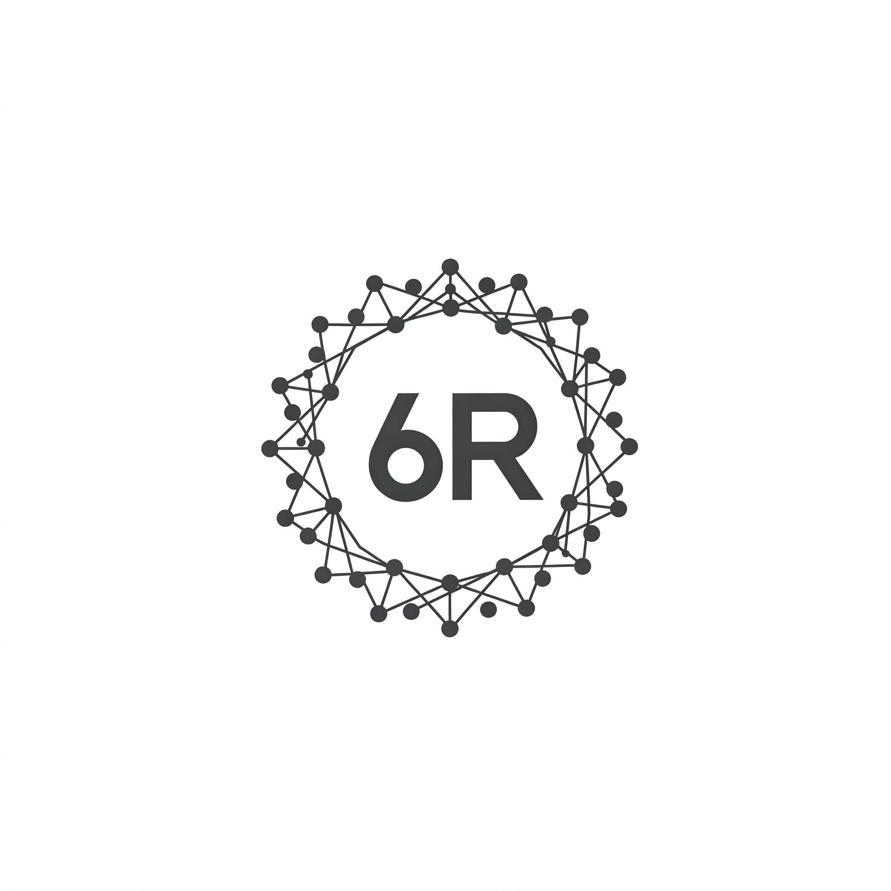
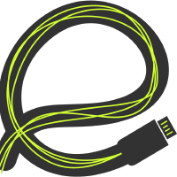

# My Projects and Contributions

This page is a curated overview of the projects I build, maintain, or contribute to. The rest of this page adds context about the longer-term initiatives and communities behind that work.

## Software Projects

These are the software projects that best represent what I am building and maintaining right now.

<table class="project-table">
    <thead>
        <tr>
            <th>Project</th>
            <th>Description</th>
            <th>Role</th>
            <th>References</th>
        </tr>
    </thead>
    <tbody>
        <tr>
            <td>LEOPath</td>
            <td>A user-friendly, extensible Python-based simulator for analyzing routing algorithms in LEO satellite constellations.</td>
            <td>Maintainer and lead developer at i2CAT.</td>
            <td>
              <a target="_blank" href="https://github.com/Fundacio-i2CAT/LEOPath">GitHub</a> 
              <a target="_blank" href="https://pypi.org/project/leopath/">PyPI</a>
            </td>
        </tr>
        <tr>
            <td>AUCOOP-Mint</td>
            <td>A lightweight, no-nonsense, Windows-like OS for non-tech users with low-end refurbished hardware in mind.</td>
            <td>Contributor and maintainer for AUCOOP's refurbished-laptop software stack.</td>
            <td>
              <a target="_blank" href="https://github.com/aucoop/AUCOOP-Mint">GitHub</a> 
              <a target="_blank" href="https://aucoop.github.io/AUCOOP-Mint/">Docs</a>
            </td>
        </tr>
        <tr>
            <td>Community-Network-Handbook</td>
            <td>A field guide to build community networks from scratch.</td>
            <td>Contributor and editor for AUCOOP's community-network deployment documentation.</td>
            <td>
              <a target="_blank" href="https://github.com/aucoop/Community-Network-Handbook">GitHub</a> 
              <a target="_blank" href="https://aucoop.github.io/Community-Network-Handbook/">Site</a>
            </td>
        </tr>
        <tr>
            <td>PLMN-GraphSim</td>
            <td>Julia-based discrete event simulator that works over network graphs from national-grade mobile network operators.</td>
            <td>Contributor and researcher working on 6G network simulation and experimentation.</td>
            <td>
              <a target="_blank" href="https://github.com/Fundacio-i2CAT/PLMN-GraphSim">GitHub</a> 
              <a target="_blank" href="https://docs.plmngraphsim.org">Docs</a>
            </td>
        </tr>
        <tr>
            <td>opencode-sessions</td>
            <td>Small CLI to search and reopen OpenCode sessions across all local projects.</td>
            <td>Personal utility I built to speed up local AI-assisted development workflows.</td>
            <td><a target="_blank" href="https://github.com/sergio-gimenez/opencode-sessions">GitHub</a></td>
        </tr>
        <tr>
            <td>sergio-setup</td>
            <td>Personal workstation bootstrap scripts.</td>
            <td>My reproducible Linux setup for dev tools, shell, editor, keyboard, and sync services.</td>
            <td><a target="_blank" href="https://github.com/sergio-gimenez/sergio-setup">GitHub</a></td>
        </tr>
    </tbody>
</table>

## Work Around The Software

These are the longer-term initiatives and communities where I participate that shape a lot of the software work above.

<table class="project-table">
    <thead>
        <tr>
            <th>Logo</th>
            <th>Title</th>
            <th>Description</th>
            <th>Role</th>
            <th>References</th>
        </tr>
    </thead>
    <tbody>
        <tr>
            <td></td>
            <td>Hahatay Network</td>
            <td>A volunteer-driven community network in rural Senegal.</td>
            <td>Started in 2021. Today I lead and support much of the technical work.</td>
            <td>
              <a target="_blank" href="https://hahatay.network">Site</a> 
              <a target="_blank" href="https://github.com/aucoop/hahatay-community-network">GitHub</a>
            </td>
        </tr>
        <tr>
            <td></td>
            <td>6G-RUPA</td>
            <td>Research on improving future mobile networks using recursive architectures.</td>
            <td>This is the core topic of my PhD and a recurring theme in several simulators above.</td>
            <td><a target="_blank" href="https://6grupa.com">Site</a></td>
        </tr>
        <tr>
            <td></td>
            <td>AUCOOP</td>
            <td>UPC student association focused on cooperation projects related to IT.</td>
            <td>Actively involved since 2017. Current president since 2025.</td>
            <td><a target="_blank" href="https://aucoop.upc.edu/">Site</a></td>
        </tr>
        <tr>
            <td></td>
            <td>eReuse</td>
            <td>Open-source lifecycle management software for refurbishing, traceability, wiping, and diagnostics.</td>
            <td>Contributor to the eReuse software ecosystem around refurbished devices.</td>
            <td><a target="_blank" href="https://ereuse.org/">Site</a></td>
        </tr>
        <tr>
            <td></td>
            <td>Labdoo</td>
            <td>A volunteer network that provides refurbished laptops to schools in need.</td>
            <td>Hub manager at i2CAT and AUCOOP, contributing to projects in Senegal, Namibia, and Pakistan.</td>
            <td><a target="_blank" href="https://www.labdoo.org/en/">Site</a></td>
        </tr>
    </tbody>
</table>

## Other Code Projects

Smaller software projects I built in the past to learn, experiment, or scratch a specific itch.

<table class="project-table">
    <thead>
        <tr>
            <th>Title</th>
            <th>Description</th>
            <th>References</th>
        </tr>
    </thead>
    <tbody>
        <tr>
            <td>GitHub wiki to Hugo</td>
            <td>A project that converts pages from a GitHub wiki into Hugo articles.</td>
            <td><a target="_blank" href="https://github.com/sergio-gimenez/python-scaffolding">GitHub</a></td>
        </tr>
        <tr>
            <td>Python Scaffolding</td>
            <td>A Python scaffolding project.</td>
            <td><a target="_blank" href="https://github.com/sergio-gimenez/python-scaffolding">GitHub</a></td>
        </tr>
        <tr>
            <td>Anomaly 4G Detection</td>
            <td>A project for detecting anomalies in 4G networks.</td>
            <td><a target="_blank" href="https://github.com/sergio-gimenez/anomaly-4G-detection">GitHub</a></td>
        </tr>
        <tr>
            <td>Blockfunding</td>
            <td>A blockchain-based crowdfunding platform.</td>
            <td><a target="_blank" href="https://github.com/gerardcastell/blockfunding">GitHub</a></td>
        </tr>
    </tbody>
</table>

## Open Source Software I Use and Support

I am a strong believer in open source software, so I have allocated a few bucks every month to support some of the projects that I use almost everyday and would be hard to live without them.

<table class="project-table">
    <thead>
        <tr>
            <th>Title</th>
            <th>Description</th>
            <th>References</th>
        </tr>
    </thead>
    <tbody>
        <tr>
            <td>Graphene OS</td>
            <td>De-googled, privacy friendly Android OS</td>
            <td><a target="_blank" href="https://grapheneos.org/">Site</a></td>
        </tr>
        <tr>
            <td>Betterbird</td>
            <td>My day-to-day mail client, calendar aggregator and matrix client</td>
            <td><a target="_blank" href="https://www.betterbird.eu/">Site</a></td>
        </tr>
        <tr>
            <td>Logseq</td>
            <td>A privacy-first, open-source knowledge base</td>
            <td><a target="_blank" href="https://logseq.com/">Site</a></td>
        </tr>
        <tr>
            <td>Debian</td>
            <td>My main Linux Distro since 2019</td>
            <td><a target="_blank" href="https://www.debian.org/">Site</a></td>
        </tr>
        <tr>
            <td>Bitwarden</td>
            <td>My password manager of choice</td>
            <td><a target="_blank" href="https://elementary.io/">Site</a></td>
        </tr>
        <tr>
            <td>OpenWISP</td>
            <td>Open-source network management system for managing network infrastructure</td>
            <td><a target="_blank" href="https://openwisp.org/">Site</a></td>
        </tr>
    </tbody>
    </table>

## Non-Tech Projects

Here is a list about non-tech projects I'm involved to. I believe that technology can be used to improve the world, but it is not the only way to do so. I am involved in several non-tech projects that aim to make a difference in the world. 

<table class="project-table">
    <thead>
        <tr>
            <th>Title</th>
            <th>Description</th>
        </tr>
    </thead>
    <tbody>
        <tr>
            <td><a href="/tags/camper/">Campervan Conversion</a></td>
            <td>Converting my old Citroen Jumpy from 2006 into a functional campervan for traveling around Spain and Europe in Summer, and attending festivals.</td>
        </tr>
        <tr>
            <td>Winemaking</td>
            <td>Making my own wine from grapes grown by my family.</td>
        </tr>
    </tbody>
</table>
